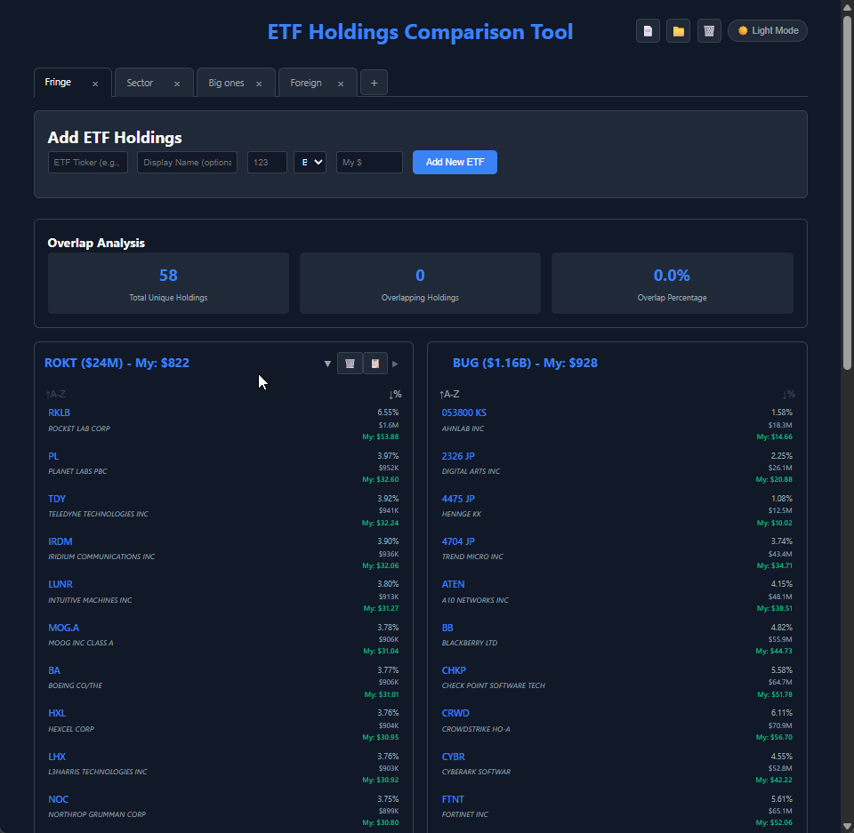

# ETF Holdings Comparison Tool

A lightweight, browser-based application for comparing and analyzing ETF holdings data. Built with modern web components and vanilla JavaScript - no frameworks required.



## Features

### ETF Data Management
- **Paste & Parse**: Copy ETF holdings data from any source and automatically detect columns
- **Smart Column Detection**: Automatically identifies ticker symbols, percentages, and descriptions
- **Multiple Data Formats**: Works with tab-separated, space-separated, or other delimited data
- **Data Validation**: Ensures clean data processing with error handling

### Financial Analysis
- **Personal Portfolio Tracking**: Enter your personal investment amount per ETF
- **Position Calculations**: See exactly how much you have invested in each underlying holding
- **Multi-Level Values**: View ETF percentages, total USD values, and your personal positions
- **Smart Formatting**: Automatic formatting for thousands (K), millions (M), and billions (B)

### Comparison & Analysis
- **Side-by-Side Comparison**: View multiple ETFs in aligned columns
- **Overlap Detection**: Automatically highlights shared holdings between ETFs
- **Overlap Statistics**: Shows total unique holdings, overlapping count, and percentages
- **Flexible Sorting**: Sort each ETF independently by ticker (A-Z) or weight (high to low)
- **Collapsible Holdings**: Collapse/expand individual ETF holdings lists
- **ETF Management**: Reorder, copy between tabs, or remove ETFs with hover controls

### Data Management
- **Browser Storage**: All data persists automatically in localStorage
- **Import/Export**: JSON-based backup and restore functionality
- **Data Migration**: Seamless upgrades from older versions

### User Experience
- **Dark/Light Theme**: Toggle between themes with persistent preference
- **Responsive Design**: Works on desktop, tablet, and mobile devices
- **Tab System**: Organize different comparison sets with tab close confirmation
- **Hover Controls**: Interactive buttons appear on hover for clean interface
- **Optional Display Names**: Add descriptive names alongside ETF tickers

## Quick Start

1. **Open the Application**
   ```
   Open index.html in any modern web browser
   ```

2. **Add Your First ETF**
   - Enter ETF name (e.g., "CIBR")
   - Set total value (e.g., "2" with "B" for $2 billion)
   - Enter your personal investment amount
   - Click "Add New ETF"

3. **Import Holdings Data**
   - Paste ETF holdings data from your broker or ETF provider
   - Click "Detect Columns" to auto-map data fields
   - Select ticker and percentage columns
   - Click "Process ETF"

4. **Compare ETFs**
   - Add multiple ETFs to see side-by-side comparison
   - Overlapping holdings are highlighted in yellow
   - View overlap statistics at the top

## Data Format Examples

The tool works with various data formats. Here are examples:

### Format 1: Tab-Separated
```
% of Net Assets    Ticker    Name                      Market Value ($)
7.04              ZS        ZSCALER INC               81,879,548.40
6.11              CRWD      CROWDSTRIKE HO-A          70,988,958.04
```

### Format 2: Space-Separated
```
Name                    Ticker    Weight    Shares Held
ROCKET LAB CORP         RKLB      6.554676  30632.000
PLANET LABS PBC         PL        3.966075  143497.000
```

## File Structure

```
etf-compare/
├── index.html      # Main application file
├── styles.css          # All CSS styles and theming
├── components.js       # Web components (ETF management, comparison)
├── utils.js           # Utilities (theme, import/export, initialization)
├── README.md          # This file
└── CLAUDE.md          # Development context for Claude AI
```

## Technical Details

### Architecture
- **Pure Web Components**: No frameworks, built with vanilla JavaScript
- **CSS Custom Properties**: Theme system with CSS variables
- **LocalStorage**: Client-side data persistence

### Components
- **ETFTabsManager**: Tab system and data import/export
- **ETFInputSection**: ETF data entry and processing
- **ETFComparisonView**: Holdings comparison and overlap analysis

## Privacy & Security

- **100% Client-Side**: No data sent to external servers
- **Local Storage Only**: All data stays in your browser
- **No Tracking**: No analytics or tracking code
- **Open Source**: Full source code available for inspection

## Advanced Features

### Tab Organization
Create separate tabs for different comparison sets:
- Tech ETFs (CIBR, HACK, BUG)
- Bond Funds (BND, AGG, TLT)
- International (VTI, VXUS, VEA)

### Import/Export
- **Export**: Download all data as JSON for backup
- **Import**: Restore data from JSON file
- **Migration**: Automatic upgrade from older versions

### Personal Investment Tracking
See exactly how your money is allocated:
- ETF Level: "CIBR ($23B) - My: $5,000"
- Holding Level: "AAPL 5.2% - $260 - My: $260"

## Version History

- **v1.0**: Initial release with basic ETF comparison
- **v1.1**: Added dark mode and hover effects
- **v1.2**: Introduced tab system for multiple comparison sets
- **v1.3**: Added personal investment tracking
- **v1.4**: Modular file structure and improved maintainability
- **v1.5**: Enhanced UI with per-ETF sorting, collapsible holdings, ETF reordering, tab close confirmation, and streamlined ETF management
